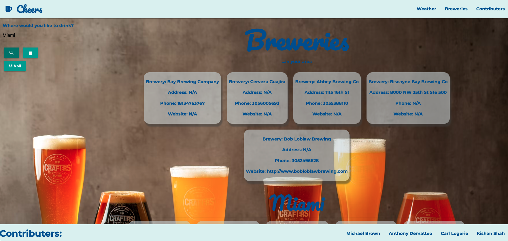

# Cheers - Your Very Own Travel Guide

Designed for those who love traveling and trying out local breweries, this application allows the user to enter a city of their choice and returns a 5 day weather forecast along with the top brewery searches in the city that the user has selected. To use this site, the user simply types the city that they are interested in searching into the text form and the top 5 breweries show up - providing the user with the weather forecast and breweries' name, address, phone number, and website.

### List of technologies and resources used:
- HTML
- CSS
- Javascript
- jQuery
- Server-side APIs
- Web APIs
- Materialize.CSS
- Animate.CSS
- Google fonts
- Font awesome
- Unsplash

### Collaborators: 
- Kishan Shah - [Link to Kishan's Github](https://github.com/kishanshah98)
- Michael Brown - [Link to Michael's Github](https://github.com/micbrwn)
- Carl Logerie - [Link to Carl's Github](https://github.com/clogerie92)
- Anthony Dematteo - [Link to Anthony's Github](https://github.com/AntDeMatteo)

## Screenshot

## Display Link

[Deployed Link of Project 1](https://kishanshah98.github.io/Travel-Guide/)

